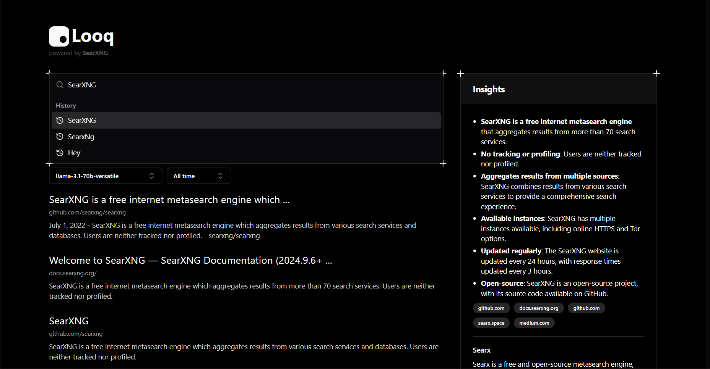

## Looq

This project is a SearXNG frontend built natively for Cloudflare Pages using [Hono](https://github.com/honojs/hono) and React with [shadcn/ui](https://ui.shadcn.com/)

## Features

- AI-powered search result summarization
- Native integration with Cloudflare Pages Functions via Hono